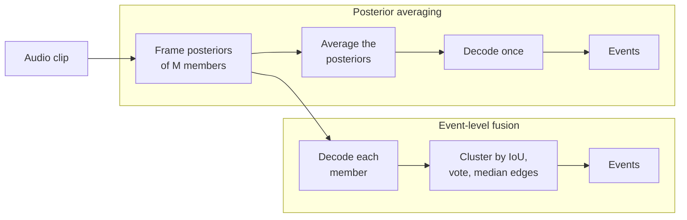
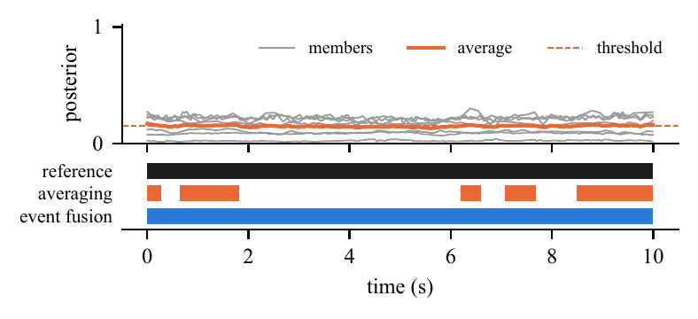
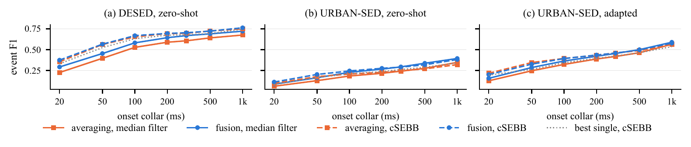

# Decoder First, Fusion Second

**Ensembling sound event detectors: what the decoder fixes, and what event-level fusion fixes.**

[](LICENSE)


Manish Joshi and Neeraj Singh Aithani (equal contribution)

Ensembles of sound event detection (SED) models are usually built by averaging the members' frame-level posteriors and decoding that average with a threshold and a median filter.
This repository asks where the errors of such ensembles come from.
It separates the contribution of the **decoder** (median filter versus change-point decoding with cSEBB) from the contribution of the **ensemble rule** (posterior averaging versus fusion of the members' decoded events), on three datasets and with nine public detectors.

## TL;DR

- **The decoder sets where event edges fall.** With a median filter, single models, averaged ensembles and fused ensembles misplace onsets alike (about 60 ms on DESED); change-point decoding (cSEBB) roughly halves that error for all of them.
- **Event fusion decides which events survive.** Averaging keeps most of its members' fragmented events and weakly supported false alarms; voting on decoded events removes most of them.
- **So choose the decoder first.** With a median filter, event fusion beats even well-tuned averaging by 0.02 to 0.04 event F1 in seven of ten settings. After cSEBB, the choice between averaging and fusion changes F1 by less than 0.01 in most settings.

## Which should I use?

| your situation | recommendation |
|---|---|
| you can change the decoder | decode with cSEBB, then average |
| members are uncalibrated (e.g. zero-shot class maps with different scales) | decode with cSEBB, then fuse events |
| the pipeline must keep a threshold and median filter | fuse events |
| you evaluate over all thresholds (PSDS) | average; fused events have no native score |
| always | compare both on development data first; fusion fails when weak members hold the majority |

## How the two ensembles differ



Averaging makes every decision on one averaged curve.
Event fusion lets every member decide first and then votes on the decoded events.
On long, steady events the averaged curve can hover at its threshold and break one event into fragments, while each member, decoded with its own threshold, sees a single event:

<p align="center"></p>

## Results at a glance

Event F1 at a 200 ms collar with per-class post-processing (DESED cross-fitted; URBAN-SED and TUT-SED scored once on the untouched test split).
The best value in each row is in bold.

| setting | averaging + gap filling and min. duration (median filter) | event fusion (median filter) | averaging (cSEBB) | event fusion (cSEBB) |
|---|---|---|---|---|
| DESED, zero-shot members | 0.614 | 0.644 | 0.694 | **0.696** |
| URBAN-SED, zero-shot members | 0.227 | 0.267 | 0.229 | **0.277** |
| URBAN-SED, adapted members | 0.408 | 0.421 | 0.433 | **0.436** |
| URBAN-SED, trained BiGRU heads | 0.366 | 0.394 | **0.421** | 0.412 |
| TUT-SED, adapted members | 0.116 | 0.116 | **0.143** | 0.132 |

Across collars from 20 ms to 1 s the picture is the same (solid: median filter; dashed: cSEBB; blue: event fusion; orange: averaging):

<p align="center"></p>

Under threshold-swept PSDS, averaging is at least as good (DESED PSDS1: 0.527 for averaging, 0.513 for fusion with a swept shared threshold), so event fusion is a tool for a fixed operating point.

## Use event fusion on your own detectors

`src/sedlib.py` has no dependencies beyond NumPy and SciPy.

```python
import sys
sys.path.insert(0, "src")
import sedlib as L

# probs: one array per member, shape (clips, classes, frames) on a 10 ms grid, values in [0, 1]
member_events = [L.decode(p, 0.3, 9) for p in probs]          # threshold 0.3, 9-frame median filter
fused = L.wbf_1d(member_events, n_classes=probs[0].shape[1],
                 iou_thr=0.5, min_votes=2)                     # keep events at least 2 members agree on
# fused[clip][class] -> [(onset_s, offset_s, votes), ...]
```

The fusion step, `sedlib.wbf_1d`, is weighted boxes fusion on time intervals:

1. Decode every member into events.
2. For each clip and class, visit the events in order of confidence; each joins the cluster it overlaps with the highest IoU (at least `iou_thr`) that has no event from the same member, or starts a new cluster.
3. Set each cluster's interval to the median onset and median offset of its events.
4. Keep clusters supported by at least `min_votes` members, and merge overlapping kept clusters.

## Reproduce the paper

### Tables from the shipped results (a few minutes, no audio needed)

```bash
pip install numpy scipy
python src/make_tables.py        # writes tables/tab_main.tex, tab_controls.tex, tab_mech.tex
```

### Everything from audio

Install the environment and the third-party code (pinned to the commits used in the paper):

```bash
python -m venv .venv && source .venv/bin/activate
pip install "numpy<2" cython
pip install -r requirements.txt --no-build-isolation
bash scripts/setup_third_party.sh
```

Download the data into `$SED_DATA` (default `./data`):

| source | place under `$SED_DATA` |
|---|---|
| DESED public evaluation, [Zenodo 3588172](https://zenodo.org/records/3588172) (`DESEDpublic_eval.tar.gz`) | `datasets/dataset/` |
| URBAN-SED v2.0.0, [Zenodo 1324404](https://zenodo.org/records/1324404) | `datasets/URBAN-SED_v2.0.0/` |
| TUT Sound Events 2017, development [Zenodo 814831](https://zenodo.org/records/814831) and evaluation [Zenodo 1040179](https://zenodo.org/records/1040179) | `datasets/tutsed/TUT-sound-events-2017-{development,evaluation}/` |
| PANNs CNN14 DecisionLevelMax, [Zenodo 3987831](https://zenodo.org/records/3987831) | `checkpoints/Cnn14_DecisionLevelMax_mAP=0.385.pth` |
| DCASE 2023 Task 4 baseline, [Zenodo 7759146](https://zenodo.org/records/7759146) | `checkpoints/dcase2023/` (unzipped) |

The seven AudioSet-Strong members (BEATs, ATST-Frame, PaSST, M2D, ASiT and two MobileNets) come from [PretrainedSED](https://github.com/fschmid56/PretrainedSED), which downloads its checkpoints on first use.
No audio or third-party checkpoint is redistributed here.

Then run the pipeline, all at once or one stage at a time:

```bash
bash scripts/reproduce.sh                  # all stages
bash scripts/reproduce.sh cache            # member posteriors for every clip
bash scripts/reproduce.sh adapt            # adapted members and trained BiGRU heads
bash scripts/reproduce.sh ensembles        # every ensembling run (scripts/ensembles.sh)
bash scripts/reproduce.sh analysis         # error decomposition and PSDS
bash scripts/reproduce.sh tables           # tables and figures
```

Everything runs on CPU.
Caching the members and the cSEBB runs take hours; the other stages take minutes to an hour.

### Where each result comes from

| in the paper | result files in `results/` |
|---|---|
| Table 1 (main comparison) | `cw_*`, `ut_*`, `tut_*`, `pp_*` |
| Table 2 (tuning controls) | `pp_*` |
| Table 3 (error decomposition) | `support_v5_desed_raw`, `support_v4_urban_*` |
| Fig. 1 (F1 versus collar) | `cw_desed_raw`, `ut_urban_zs_raw`, `ut_urban_ad_raw` |
| PSDS | `psds_*` |
| fixed 200 ms operating point | `fxs_*` |
| further DESED splits | `rs*` |
| ensemble composition | `desed_raw_top*`, `het_*` |

`results/README.md` explains the file names, and `scripts/ensembles.sh` holds the exact command behind every file.

## Repository layout

```
src/
  sedlib.py            decoders (median filter, cSEBB), event fusion, collar-based event F1
  ensemble_arms.py     all ensembling arms, cross-fitting or dev-split tuning, collar sweep, bootstrap
  cache_*.py           member posteriors (PretrainedSED, PANNs, DCASE 2023 baseline CRNN)
  adapt_members.py     adapted members: per-frame logistic heads on AudioSet-Strong logits
  train_heads.py       trained members: BiGRU heads on frozen logits
  support_analysis.py  edge error on commonly matched references, fragmentation, false alarms
  psds_arms.py         PSDS1 and PSDS2
  make_tables.py       the paper's tables
  fig_*.py             the paper's figures
lists/                 DESED clips excluded for AudioSet overlap, TUT-SED splits
results/               result files behind every number in the paper
scripts/               third-party setup and the reproduction pipeline
docs/                  figures used in this README
```

## Protocol notes

- **Datasets.** DESED public evaluation (667 clips after removing the 25 whose YouTube identifier appears in any AudioSet split, listed in `lists/`), URBAN-SED (official splits) and TUT Sound Events 2017 street (recordings cut into 10 s clips).
- **Tuning.** Every threshold, filter, fusion setting and calibration map is chosen on data that is not scored. DESED is cross-fitted on two folds of its evaluation set, so absolute DESED scores are not comparable to published systems; only differences between methods are. URBAN-SED and TUT-SED are tuned on their development splits and the test split is scored once.
- **Metric.** Event F1 as in sed_eval: onset collar c, offset collar max(c, 0.2 x duration), macro-averaged over classes, at collars from 20 ms to 1 s, with paired clip-bootstrap intervals.
- **Limits.** Most members share AudioSet pre-training, TUT-SED is small (171 test clips), and independently trained target-domain systems were not ensembled.

## Acknowledgements

This work builds on [PretrainedSED](https://github.com/fschmid56/PretrainedSED), [DESED_task](https://github.com/DCASE-REPO/DESED_task), [sebbs](https://github.com/merlresearch/sound_event_bounding_boxes), [sed_scores_eval](https://github.com/fgnt/sed_scores_eval), [sed_eval](https://github.com/TUT-ARG/sed_eval) and [PANNs](https://github.com/qiuqiangkong/audioset_tagging_cnn), and on the DESED, URBAN-SED and TUT Sound Events 2017 datasets.

## License

MIT, see [LICENSE](LICENSE).
Datasets and third-party models keep their own licenses.
